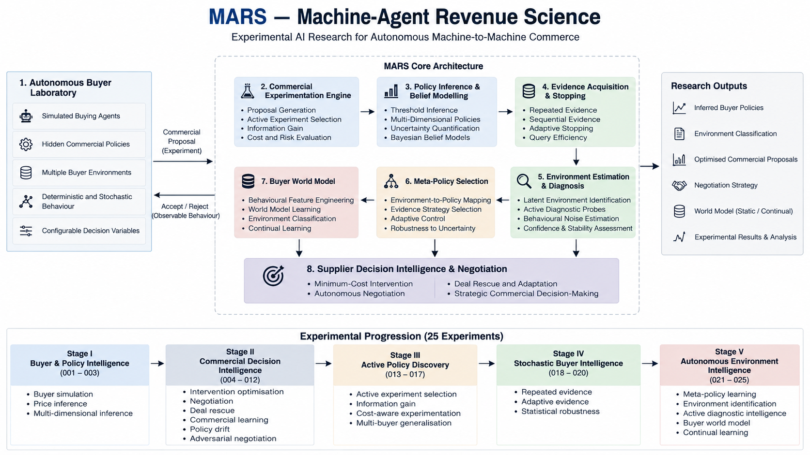

# MARS — Machine-Agent Revenue Science

### Black-Box Buyer Intelligence for Autonomous B2B Commerce

**An Experimental AI Framework for Buyer Policy Inference, Active Commercial Experimentation, Autonomous Negotiation, Buyer World-Model Learning, and Machine-to-Machine Commercial Intelligence**

**Author:** Kamran Khan  
**Research Programme:** Experiments 001–025  
**Status:** 25-Experiment Experimental Programme Completed

---

# Overview

MARS — Machine-Agent Revenue Science — is an experimental artificial intelligence framework designed to investigate how autonomous purchasing agents evaluate commercial proposals and how intelligent supplier systems can adapt when the buyer's internal decision-making policies are unknown.

The project explores the intersection of:

- autonomous AI agents;
- B2B procurement;
- commercial intelligence;
- active learning;
- experimental optimisation;
- machine-to-machine negotiation;
- stochastic decision systems;
- adaptive evidence acquisition;
- buyer-environment modelling;
- world-model learning;
- and continual machine learning.

Rather than developing another conventional sales automation application, MARS investigates a more fundamental question concerning the future of autonomous commerce:

> **Can an intelligent supplier system discover how an autonomous buyer makes purchasing decisions without accessing the buyer's internal decision-making process?**

Across 25 sequential computational experiments, this question evolves further:

> Can the supplier decide what to investigate, how much evidence it needs, which learning strategy to use, how to model an unfamiliar buyer environment, and whether new buyer experiences should become part of its long-term knowledge?

MARS investigates these questions through controlled computational experiments involving simulated purchasing agents, black-box policy inference, commercial intervention, adaptive experimentation, negotiation, stochastic buyer behaviour, environment estimation, world-model learning and continual adaptation.

---
---

## MARS Research Architecture

<p align="center">
  
</p>

<p align="center">
  <em>
    End-to-end architecture of the MARS experimental framework, showing the progression
    from autonomous buyer simulation and black-box commercial experimentation through
    policy inference, active evidence acquisition, environment diagnosis,
    meta-policy selection, buyer world modelling, and supplier decision intelligence.
  </em>
</p>

---
---

# The Problem

Traditional B2B sales processes are primarily designed around human decision-makers.

However, as organisations increasingly investigate autonomous AI agents for procurement and commercial decision support, suppliers may eventually encounter purchasing systems whose internal objectives, evaluation criteria and decision policies are inaccessible.

A supplier may observe whether a proposal is accepted or rejected without understanding which commercial conditions influenced the outcome.

For example, a supplier might submit a commercially competitive proposal that an autonomous purchasing agent rejects.

The supplier may not know whether the rejection resulted from:

- pricing constraints;
- contract duration;
- supplier reliability;
- payment terms;
- service-level requirements;
- operational risk;
- compliance requirements;
- total cost of ownership;
- or other hidden procurement preferences.

Without understanding these decision patterns, suppliers may repeatedly modify proposals without knowing which changes are commercially necessary.

MARS investigates whether controlled machine-to-machine experimentation can recover useful information about hidden buyer policies and support commercially rational supplier decisions.

---

# Research Question

The original MARS research question is:

> **Can an AI system infer the decision policies of autonomous purchasing agents through controlled commercial experiments and identify minimum-cost interventions that improve supplier acceptance without accessing the buyer's internal decision-making process?**

As the experimental programme developed, the research expanded into a broader question:

> **How can an autonomous supplier learn to make commercially effective decisions when interacting with machine buyers whose internal policies, thresholds, behavioural uncertainty and operating environments are hidden?**

---

# Core Research Objectives

The MARS research programme investigates the following objectives:

1. Develop a simulated autonomous B2B purchasing environment.
2. Construct purchasing agents with hidden commercial objectives and constraints.
3. Implement a black-box experimentation framework for evaluating supplier proposals.
4. Investigate algorithms for inferring hidden buyer decision policies.
5. Develop minimum-cost commercial intervention mechanisms.
6. Investigate autonomous supplier-buyer negotiation.
7. Examine contextual commercial learning.
8. Investigate buyer-policy drift and adaptive recovery.
9. Examine adversarial negotiation and buyer defence mechanisms.
10. Develop active buyer-policy discovery.
11. Investigate information-gain-based experiment selection.
12. Introduce commercial cost and risk into experiment selection.
13. Examine generalisation across heterogeneous buyers.
14. Investigate stochastic buyer behaviour.
15. Develop repeated and sequential evidence mechanisms.
16. Reduce unnecessary buyer interactions through adaptive stopping.
17. Evaluate statistical robustness across multiple environments.
18. Learn environment-dependent evidence strategies.
19. Infer latent buyer environments from observed behaviour.
20. Develop active diagnostic intelligence.
21. Learn buyer world models from historical interactions.
22. Investigate continual buyer world-model adaptation.
23. Evaluate whether additional autonomous learning necessarily improves performance.
24. Preserve negative experimental findings rather than optimising experiments solely for favourable outcomes.
25. Establish a reproducible research framework for studying machine-to-machine commercial intelligence.

---

# MARS Experimental Architecture

MARS is organised into interconnected research components supporting increasingly autonomous commercial decision-making.

The final conceptual architecture can be represented as:

```text
                    AUTONOMOUS BUYER
                           │
                           ▼
                COMMERCIAL INTERACTION
                           │
                           ▼
                 OBSERVABLE BEHAVIOUR
                           │
                           ▼
                  DIAGNOSTIC PROBES
                           │
                           ▼
                 POLICY INFERENCE
                           │
                           ▼
                UNCERTAINTY ESTIMATION
                           │
                           ▼
              ACTIVE EVIDENCE ACQUISITION
                           │
                           ▼
               ENVIRONMENT ESTIMATION
                           │
                           ▼
                 META-POLICY SELECTION
                           │
                           ▼
                  BUYER WORLD MODEL
                           │
                           ▼
              SUPPLIER DECISION INTELLIGENCE
                           │
                           ▼
            COMMERCIAL STRATEGY / NEGOTIATION
```

The architecture did not begin at this level.

It evolved incrementally through 25 experiments.

---

# 1. Autonomous Buyer Laboratory

A simulated procurement environment contains autonomous purchasing agents with hidden commercial decision policies.

Commercial decision variables may include:

- price;
- contract duration;
- service-level agreements;
- supplier reliability;
- payment terms;
- compliance requirements;
- operational risk;
- total cost of ownership.

Buyer policies remain hidden from the supplier-facing intelligence system during black-box experimentation where policy discovery is being evaluated.

The laboratory provides a controlled environment for investigating how autonomous buyers respond to commercial proposals.

**Implementation directory:** `buyer_lab/`

---

# 2. Black-Box Buyer Policy Inference

The inference architecture investigates purchasing-agent behaviour through observable proposal outcomes.

Instead of directly accessing the buyer's internal decision rules, the supplier-facing system conducts experiments and analyses resulting purchasing decisions.

Research includes:

- single-variable policy inference;
- multi-dimensional inference;
- threshold discovery;
- active experiment selection;
- uncertainty reasoning;
- repeated evidence;
- sequential evidence;
- environment inference;
- and behavioural world models.

**Implementation directory:** `inference/`

---

# 3. Commercial Experimentation Engine

The experimentation framework provides a controlled environment for submitting commercial proposals and observing purchasing-agent responses.

Experiments investigate:

- buyer decision patterns;
- hidden commercial constraints;
- proposal acceptance conditions;
- commercial intervention;
- adaptive learning;
- negotiation behaviour;
- information gain;
- query efficiency;
- stochastic evidence;
- environment diagnosis;
- and continual learning.

**Implementation directory:** `experiments/`

---

# 4. Minimum Winning Intervention Engine

The optimisation component investigates how suppliers can identify commercially viable proposal modifications while controlling intervention cost.

Instead of automatically offering the largest discount or most generous contractual conditions, the system investigates which modifications are actually necessary to satisfy buyer requirements.

Potential interventions include:

- price adjustments;
- contract modifications;
- service-level improvements;
- payment-term adjustments;
- risk mitigation measures.

**Implementation directory:** `optimization/`

---

# 5. Autonomous Negotiation Laboratory

The negotiation environment investigates interactions between autonomous buyer and supplier systems.

Research includes:

- commercial proposal evaluation;
- negotiation strategies;
- adaptive counteroffers;
- buyer responses;
- adversarial negotiation;
- buyer defence mechanisms;
- and evidence-based supplier reasoning.

The objective is to investigate how autonomous commercial systems behave when purchasing and supplier objectives differ.

**Implementation directory:** `negotiation/`

---

# 6. Active Commercial Intelligence

Later MARS experiments move beyond passive observation.

The supplier begins determining which commercial interaction should occur next.

The active intelligence layer investigates:

```text
Which variable should be tested?

Which proposal is most informative?

How much information could the proposal reveal?

What commercial risk does the experiment create?

How much evidence has already been collected?

Should experimentation continue or stop?
```

This turns commercial experimentation itself into an AI decision problem.

---

# 7. Buyer Environment Intelligence

Stochastic buyer behaviour introduces another challenge.

Observed buyer decisions may be affected by behavioural uncertainty.

MARS therefore develops mechanisms for:

- repeated evidence;
- adaptive evidence accumulation;
- stochastic robustness;
- environment estimation;
- evidence-policy selection;
- and active diagnosis.

The system begins reasoning not only about:

```text
WHAT DOES THE BUYER REQUIRE?
```

but also:

```text
WHAT KIND OF BUYER ENVIRONMENT
AM I CURRENTLY OBSERVING?
```

---

# 8. Buyer World Model

Experiment 024 introduces a learned buyer world model.

Historical diagnostic interactions are transformed into observable behavioural features.

These features include behavioural statistics associated with:

- acceptance behaviour;
- disagreement;
- minority decisions;
- prediction entropy;
- behavioural stability;
- and instability.

The world model learns associations between historical behavioural patterns and simulated buyer environments.

This creates a transition from manually designed environment reasoning toward learned behavioural representation.

---

# Complete Experimental Programme

# Experiments 001–025

The MARS research programme contains 25 sequential experiments.

---

## Experiment 001 — Autonomous Buyer Simulation

**File:** `experiments/test_buyer.py`

Establishes the autonomous buyer laboratory.

The experiment introduces a simulated purchasing agent with internal procurement decision policies.

It provides the foundational environment for investigating how autonomous buyers evaluate commercial proposals.

---

## Experiment 002 — Black-Box Buyer Price Inference

**File:** `experiments/test_policy_inference.py`

Investigates whether purchasing constraints associated with price can be inferred through controlled proposal experiments.

The experiment introduces the central black-box inference problem:

> Learning about buyer decision policies from observable purchasing outcomes.

---

## Experiment 003 — Multi-Dimensional Buyer Policy Inference

**File:** `experiments/test_multidimensional_inference.py`

Extends buyer-policy inference beyond a single commercial variable.

The experiment investigates purchasing decisions involving multiple commercial attributes.

Its objective is to explore how combinations of proposal characteristics influence autonomous buyer behaviour.

---

## Experiment 004 — Minimum Winning Commercial Intervention

**File:** `experiments/test_minimum_intervention.py`

Investigates how a supplier-facing intelligence system can identify proposal modifications that satisfy buyer requirements while controlling supplier-side intervention costs.

The experiment introduces commercial optimisation into the buyer-intelligence framework.

---

## Experiment 005 — Autonomous Negotiation

**File:** `experiments/test_negotiation.py`

Introduces autonomous commercial negotiation.

The experiment investigates interactions between buyer and supplier decision-making systems.

It extends MARS from observing purchasing decisions toward commercial negotiation behaviour.

---

## Experiment 006 — Commercial Deal Rescue

**File:** `experiments/test_deal_rescue.py`

Investigates whether rejected commercial proposals can be reconsidered through targeted modifications.

The experiment explores the relationship between buyer-policy inference and commercially viable deal recovery.

---

## Experiment 007 — Contextual Commercial Learning

**File:** `experiments/test_commercial_learning.py`

Introduces contextual commercial learning.

The experiment investigates how information obtained from commercial interactions can inform subsequent decision-making.

---

## Experiment 008 — Adaptive Negotiation Benchmark

**File:** `experiments/test_adaptive_negotiation.py`

Introduces an experimental benchmark for adaptive commercial negotiation.

The experiment investigates negotiation behaviour where supplier strategies respond to observed buyer behaviour.

---

## Experiment 009 — Buyer Policy Drift and Adaptive Recovery

**File:** `experiments/test_policy_drift.py`

Investigates changes in autonomous purchasing policies.

A buyer's commercial requirements may evolve over time, potentially reducing the usefulness of previously inferred decision patterns.

The experiment examines adaptive recovery following buyer-policy change.

---

## Experiment 010 — Adversarial Negotiation and Buyer Defence

**File:** `experiments/test_adversarial_negotiation.py`

Introduces adversarial negotiation.

The experiment investigates interactions involving competing commercial objectives and buyer defence mechanisms.

It extends MARS toward strategically challenging autonomous negotiation conditions.

---

## Experiment 011 — AI-Assisted Supplier Reasoning

Experiment 011 introduces model-assisted commercial reasoning into the experimental programme.

The experiment connects the structured MARS commercial environment with AI reasoning capabilities so that supplier strategy can incorporate generated reasoning in addition to deterministic experimental logic.

This stage begins connecting buyer-policy intelligence with more general AI supplier reasoning.

---

## Experiment 012 — Evidence-Based AI Supplier Negotiation

Experiment 012 combines active buyer-policy discovery with AI-assisted supplier negotiation.

The supplier's negotiation reasoning is informed by evidence recovered through interaction with the buyer.

This creates a stronger separation between:

```text
UNSUPPORTED NEGOTIATION ASSUMPTIONS
```

and:

```text
EVIDENCE-BASED SUPPLIER STRATEGY
```

---

## Experiment 013 — Active Buyer Policy Discovery

Experiment 013 introduces autonomous query selection.

Instead of executing only a fixed sequence of commercial tests, MARS selects buyer queries according to their potential information value.

### Result

```text
Total Buyer Queries:
58

Policy Variables Discovered:
5

Policy Coverage:
100%
```

Recovered policy estimates closely approximated the simulated thresholds.

This establishes active policy discovery as a core MARS capability.

---

## Experiment 014 — Comparative Policy Discovery Benchmark

Experiment 014 compares fixed policy discovery with autonomous query selection.

### Results

```text
Fixed Inference:
73 queries

Autonomous Active Selection:
58 queries

Query Reduction:
20.55%

Policy Coverage:
100% for both approaches
```

The experiment demonstrates that active query selection can reduce buyer interactions while preserving complete tested policy coverage.

---

## Experiment 015 — Advanced Active Policy Discovery

Experiment 015 extends the active experimentation architecture.

The system increasingly evaluates the informational value of candidate commercial experiments before execution.

This experiment develops the transition from simple policy probing toward autonomous experimental design.

---

## Experiment 016 — Cost-Aware Commercial Experimentation

Information acquisition may carry commercial cost.

Experiment 016 therefore considers:

```text
INFORMATION VALUE
       +
COMMERCIAL COST
       +
COMMERCIAL RISK
```

when selecting commercial experiments.

### Results

```text
Total Buyer Queries:
57

Resolved Variables:
5

Policy Coverage:
100%

Queries per Discovered Policy:
11.4

Total Modelled Probe Cost:
£2,100

Average Modelled Probe Cost:
£36.84

Maximum Single Probe Cost:
£1,800

Average Commercial Risk:
0.12057

Total Information Value:
9.703961

Total Cost-Aware Utility:
8.869019

Total Realised Uncertainty Reduction:
4.967035
```

This experiment establishes commercial experimentation as both an information problem and an economic decision problem.

---

## Experiment 017 — Multi-Buyer Generalisation

Experiment 017 evaluates policy-discovery strategies across multiple buyer configurations.

### Results

```text
Fixed Strategy:
INCOMPLETE GENERALISATION

Uncertainty Strategy:
COMPLETE ACROSS ALL TESTED BUYERS

Expected Information Gain:
COMPLETE ACROSS ALL TESTED BUYERS

Cost-Aware Strategy:
COMPLETE ACROSS ALL TESTED BUYERS
```

Cost-aware results included:

```text
Successful Buyers:
5

Total Modelled Probe Cost:
£5,000

Average Cost per Successful Buyer:
£1,000

Average Commercial Risk:
0.350075
```

The experiment demonstrates that strategies effective against one buyer configuration may not automatically generalise to others.

---

## Experiment 018 — Stochastic Buyer Diagnostics

Experiment 018 introduces probabilistic buyer decisions.

The same commercial proposal may no longer produce a perfectly deterministic response.

MARS compares single observations with repeated evidence.

### Single Observation

```text
Total Evaluations:
60

Noise Events:
6

Realised Noise:
0.10

Policy Coverage:
100%

Mean Normalised Error:
~0.012207655
```

### Repeated Evidence

```text
Total Evaluations:
483

Noise Events:
43

Realised Noise:
~0.089027

Policy Coverage:
100%

Mean Normalised Error:
~0.000010681
```

### Result

```text
Relative Error Reduction:
~99.91%
```

Repeated evidence substantially improves threshold estimation in the tested stochastic environment but requires many more buyer interactions.

---

## Experiment 019 — Adaptive Sequential Evidence

Experiment 019 addresses the query cost introduced by repeated evidence.

Instead of assigning the same observation budget to every candidate, MARS accumulates evidence sequentially and stops when sufficient evidence has been obtained.

### Results

```text
Fixed Repeated Queries:
483

Adaptive Sequential Queries:
267

Queries Saved:
216

Query Reduction:
44.72%

Adaptive Early Stop Rate:
91.18%

Average Observations per Candidate:
~3.88
```

The adaptive system retained approximately the same measured mean normalised error in the experiment.

---

## Experiment 020 — Statistical Robustness

Experiment 020 evaluates the stochastic inference architectures across a much larger benchmark.

### Experimental Scale

```text
20 random seeds
×
6 noise levels
×
3 architectures
=
360 discovery runs
```

covering:

```text
120 buyer environments
```

### Aggregate Results

```text
Fixed Mean Queries:
483.0583

Adaptive Mean Queries:
292.6667

Mean Queries Saved:
190.3917

Mean Query Reduction:
39.41%
```

Aggregate mean normalised errors:

```text
Fixed:
0.000881302

Adaptive:
0.000815353
```

However, fixed repeated evidence could produce lower error in individual high-noise conditions.

The correct interpretation is therefore not that adaptive evidence is universally more accurate.

Instead:

> Adaptive evidence substantially reduced average query requirements while maintaining competitive aggregate accuracy, with relative performance varying across stochastic environments.

---

## Experiment 021 — Autonomous Meta-Policy Learning

Experiment 021 asks:

> Can MARS learn which evidence-collection strategy it should use?

Candidate evidence policies include:

```text
ECONOMICAL

BALANCED

ROBUST

HIGH_ASSURANCE
```

### Experimental Scale

```text
Training Seeds:
15

Validation Seeds:
5

Noise Environments:
6

Training Runs:
360

Validation Runs:
30

Total Runs:
390
```

### Validation Results

```text
Mean Validation Coverage:
100%

Mean Validation Error:
0.0005840376479877844

Mean Validation Queries:
369.6

Failed Validation Runs:
0
```

### Learned Policy Map

```text
0.05 → BALANCED
0.10 → BALANCED
0.15 → HIGH_ASSURANCE
0.20 → ROBUST
0.25 → HIGH_ASSURANCE
0.30 → ROBUST
```

The mapping is not monotonic.

This demonstrates why environment-dependent strategy selection is more nuanced than a simple hand-coded rule based only on increasing stochasticity.

---

## Experiment 022 — Latent Buyer Environment Identification

Experiment 022 removes the assumption that MARS knows the buyer's stochastic environment.

The architecture becomes:

```text
UNKNOWN BUYER
      │
      ▼
DIAGNOSTIC PROBES
      │
      ▼
ESTIMATE ENVIRONMENT
      │
      ▼
SELECT META-POLICY
      │
      ▼
DISCOVER BUYER POLICY
```

### Results

```text
Meta-Policy Training Runs:
240

Closed-Loop Test Runs:
30

Successful Runs:
30 / 30

Mean Behavioural-Noise Estimation Error:
0.1547222222222222

Dynamic vs Oracle Policy Agreement:
66.67%

Mean Final Policy Coverage:
100%

Mean Final Normalised Error:
0.0006533958098017068

Mean Diagnostic Query Cost:
240

Mean Total Closed-Loop Queries:
870.4
```

The true simulator noise is not supplied to the estimator or controller during operational inference.

It is retained for evaluation.

---

## Experiment 023 — Active Diagnostic Intelligence

Experiment 023 replaces fixed diagnosis with active sequential diagnosis.

MARS selects diagnostic evidence and determines when sufficient confidence and stability have been achieved.

### Matched Benchmark Results

```text
Experiment 022 Mean Diagnostic Queries:
240

Experiment 023 Mean Diagnostic Queries:
74.5333

Queries Saved:
165.4667

Diagnostic Query Reduction:
68.94%
```

Environment-estimation error:

```text
Experiment 022:
0.1702778

Experiment 023:
0.0389397
```

Oracle policy agreement:

```text
Experiment 022:
60.00%

Experiment 023:
66.67%
```

Final policy coverage:

```text
Experiment 022:
100%

Experiment 023:
100%
```

Final normalised policy-discovery error:

```text
Experiment 022:
0.0011483

Experiment 023:
0.0011587
```

Active stopping:

```text
CONFIDENT_AND_STABLE:
29

MAXIMUM_QUERY_BUDGET:
1

Autonomous Stop Rate:
96.67%
```

The experiment demonstrates a substantial reduction in diagnostic interaction requirements while maintaining complete policy coverage in the matched simulated benchmark.

---

## Experiment 024 — Autonomous Buyer World Model Learning

Experiment 024 introduces a learned buyer world model.

Historical buyer interactions are transformed into nine behavioural features.

A transparent distance-weighted nearest-neighbour-style model learns associations between behavioural patterns and simulated buyer environments.

### Experimental Scale

```text
Historical Training Episodes:
120

Held-Out Validation Episodes:
60

Environment Classes:
6

Behavioural Features:
9

Training / Validation Seed Overlap:
NONE
```

### Results

```text
Correct Exact Classifications:
27 / 60

Exact Environment Classification:
45.00%

Mean Absolute Environment Error:
0.03775808843478146

Mean Prediction Confidence:
0.6194818648606951

Mean Prediction Entropy:
1.1067022653689782

Mean Diagnostic Queries:
73.7
```

### Per-Environment Accuracy

```text
0.05 → 100%

0.10 → 30%

0.15 → 50%

0.20 → 30%

0.25 → 20%

0.30 → 40%
```

The model was trained using historical supervised environment labels.

It should therefore not be described as unsupervised learning.

During held-out prediction, however, the true validation environment was not supplied to the world model.

---

## Experiment 025 — Self-Improving Buyer World Model

The final MARS experiment asks:

> **Should the buyer world model continue learning from new buyers after deployment?**

Two systems begin with identical historical memory:

```text
STATIC WORLD MODEL

versus

CONTINUAL WORLD MODEL
```

Both receive identical unseen buyer diagnostic episodes.

The continual system follows a strict causal sequence:

```text
Observe Buyer
      │
      ▼
Predict Environment
      │
      ▼
Record Prediction
      │
      ▼
Receive Delayed Feedback
      │
      ▼
Potentially Learn
      │
      ▼
Influence Future Buyers Only
```

### Experimental Scale

```text
Historical Training Episodes:
120

Matched Online Buyer Episodes:
120

Static Predictions:
120

Continual Predictions:
120

Environment Classes:
6

Behavioural Features:
9
```

### Static World Model

```text
Exact Classification Accuracy:
54.17%

Mean Absolute Environment Error:
0.03093181780115231

Mean Prediction Confidence:
0.5917610281261403
```

### Continual World Model

```text
Exact Classification Accuracy:
47.50%

Mean Absolute Environment Error:
0.032140016954918874

Mean Prediction Confidence:
0.6222319330325458
```

### Difference

```text
Accuracy Change:
-6.67 percentage points

Mean Error Change:
+0.001208199153766562
```

The continual learner became more confident while becoming less accurate.

---

# Experiment 025 — Memory Behaviour

The continual learner started with:

```text
120 historical experiences
```

and finished with:

```text
191 experiences
```

During the online stream:

```text
Experience Gaps Detected:
71

Continual Updates:
71

Learned Episodes:
71

Skipped Episodes:
49
```

Yet the additional experience did not improve overall predictive performance.

This produces one of the most important findings in the MARS programme:

> **Novel experience is not necessarily reliable experience.**

---

# Why the Negative Result Matters

It would be possible to continue modifying the continual-learning system until it beats the static baseline.

MARS deliberately does not do this within the completed experimental programme.

Experiment 025 is retained as a negative result.

The architecture demonstrates that:

```text
MORE DATA
   ≠
BETTER MEMORY

MORE MEMORY
   ≠
BETTER PREDICTION

MORE CONFIDENCE
   ≠
MORE ACCURACY
```

An unfamiliar buyer observation may represent:

- useful new information;
- stochastic noise;
- an ambiguous boundary observation;
- an outlier;
- redundant information;
- or unreliable evidence.

Therefore, autonomous systems may require mechanisms governing not only what they learn, but also what they choose **not to remember**.

---

# Experimental Progression

The complete programme can be represented as:

```text
AUTONOMOUS BUYER SIMULATION
            │
            ▼
BLACK-BOX POLICY DISCOVERY
            │
            ▼
MULTI-DIMENSIONAL INFERENCE
            │
            ▼
COMMERCIAL INTERVENTION
            │
            ▼
AUTONOMOUS NEGOTIATION
            │
            ▼
DEAL RESCUE
            │
            ▼
COMMERCIAL LEARNING
            │
            ▼
ADAPTIVE NEGOTIATION
            │
            ▼
POLICY DRIFT
            │
            ▼
ADVERSARIAL NEGOTIATION
            │
            ▼
AI SUPPLIER REASONING
            │
            ▼
EVIDENCE-BASED NEGOTIATION
            │
            ▼
ACTIVE POLICY DISCOVERY
            │
            ▼
INFORMATION-GAIN OPTIMISATION
            │
            ▼
COST-AWARE EXPERIMENTATION
            │
            ▼
MULTI-BUYER GENERALISATION
            │
            ▼
STOCHASTIC BUYER INTELLIGENCE
            │
            ▼
ADAPTIVE SEQUENTIAL EVIDENCE
            │
            ▼
STATISTICAL ROBUSTNESS
            │
            ▼
META-POLICY LEARNING
            │
            ▼
LATENT ENVIRONMENT IDENTIFICATION
            │
            ▼
ACTIVE DIAGNOSTIC INTELLIGENCE
            │
            ▼
BUYER WORLD MODEL
            │
            ▼
CONTINUAL WORLD-MODEL LEARNING
```

---

# Research Layers

| Research Layer | Experiments | Focus |
|---|---:|---|
| Buyer & Policy Intelligence | 001–003 | Buyer simulation and hidden-policy inference |
| Commercial Decision Intelligence | 004–012 | Intervention, negotiation, learning and supplier reasoning |
| Active Policy Discovery | 013–017 | Query selection, information gain, cost and generalisation |
| Stochastic Buyer Intelligence | 018–020 | Noise, repeated evidence, adaptive evidence and robustness |
| Autonomous Environment Intelligence | 021–025 | Meta-learning, diagnosis, world models and continual learning |

---

# Selected Quantitative Results

| Experiment | Research Capability | Principal Result |
|---|---|---:|
| 013 | Active Policy Discovery | 58 queries, complete tested policy discovery |
| 014 | Active vs Fixed Discovery | **20.55% query reduction** |
| 016 | Cost-Aware Discovery | **57 queries, 100% policy coverage** |
| 018 | Repeated Evidence | **~99.91% relative error reduction** |
| 019 | Adaptive Evidence | **44.72% query reduction** |
| 020 | Robustness Benchmark | **39.41% mean query reduction** |
| 021 | Meta-Policy Learning | **100% validation coverage** |
| 022 | Closed-Loop Environment Intelligence | **30/30 successful runs** |
| 023 | Active Diagnosis | **68.94% diagnostic query reduction** |
| 024 | Buyer World Model | **45.00% held-out exact classification** |
| 025 | Continual World Model | **47.50% vs 54.17% static accuracy** |

---

# Example Research Scenario

A supplier submits a commercial proposal to an autonomous purchasing agent.

| Variable | Initial Proposal |
|---|---:|
| Annual contract value | £100,000 |
| Contract duration | 24 months |
| Service availability | 95% |
| Payment terms | 30 days |
| Supplier reliability | 90% |

The purchasing agent rejects the proposal.

MARS does not automatically assume that price caused the rejection.

Instead, controlled commercial experiments can investigate which attributes influence the buyer's decision.

For example:

```text
Was the annual price too high?

Was the contract too long?

Was service availability insufficient?

Was supplier reliability below the buyer threshold?

Were payment terms unacceptable?
```

Once sufficient evidence is collected, the supplier can investigate the minimum commercially viable intervention.

Later MARS architectures extend the same scenario further.

The system may determine:

```text
Which experiment should be performed next?

How much information will it provide?

How risky is the commercial probe?

Is the buyer behaving stochastically?

How much repeated evidence is required?

Which evidence policy should be used?

What type of buyer environment is being observed?

Does this buyer resemble historical buyer behaviour?
```

This scenario illustrates the progression from simple proposal analysis toward autonomous commercial intelligence.

It should not be interpreted as a validated real-world procurement result.

---

# Research Integrity

MARS follows several experimental principles.

## Black-Box Evaluation

When an experiment evaluates hidden-policy discovery, the inference system should not simply receive the buyer's private decision thresholds.

---

## Causal Integrity

Information revealed after a prediction cannot be used to improve the prediction currently being evaluated.

Experiment 025 explicitly follows:

```text
PREDICTION
    ↓
RECORD RESULT
    ↓
REVEAL FEEDBACK
    ↓
FUTURE LEARNING
```

---

## Matched Benchmarking

Compared architectures encounter equivalent buyer environments and evidence wherever possible.

---

## Held-Out Evaluation

Training and validation seeds are separated when generalisation is being measured.

---

## Negative Results Are Retained

An experimental architecture is not modified merely because it performs worse than a baseline.

Experiment 025 is deliberately preserved as evidence of a limitation in naive continual learning.

---

## Simulation Boundary

MARS currently operates in simulated buyer environments.

Its experimental results do not establish equivalent performance against real-world autonomous procurement systems.

---

# Repository Structure

```text
mars-machine-buyer-lab/
│
├── .github/
│   └── workflows/
│       ├── mars_experiment.yml
│       ├── mars_experiment_020.yml
│       ├── mars_experiment_021.yml
│       ├── mars_experiment_022.yml
│       ├── mars_experiment_023.yml
│       ├── mars_experiment_024.yml
│       └── mars_experiment_025.yml
│
├── buyer_lab/
│   ├── buyer_agent.py
│   └── probabilistic_buyer_agent.py
│
├── inference/
│   ├── active_experiment_engine.py
│   ├── buyer_policy_belief_model.py
│   ├── buyer_policy_inference.py
│   ├── multidimensional_inference.py
│   ├── adaptive_sequential_evidence_engine.py
│   ├── meta_policy_learning_engine.py
│   ├── buyer_environment_estimator.py
│   ├── diagnostic_probe_generator.py
│   ├── dynamic_meta_policy_controller.py
│   ├── active_diagnostic_intelligence_engine.py
│   ├── buyer_world_model.py
│   ├── world_model_training_lab.py
│   └── continual_buyer_world_model.py
│
├── optimization/
│
├── negotiation/
│
├── evaluation/
│   ├── __init__.py
│   ├── policy_discovery_benchmark.py
│   └── statistical_robustness_benchmark.py
│
├── experiments/
│   ├── test_buyer.py
│   ├── test_policy_inference.py
│   ├── test_multidimensional_inference.py
│   ├── test_minimum_intervention.py
│   ├── test_negotiation.py
│   ├── test_deal_rescue.py
│   ├── test_commercial_learning.py
│   ├── test_adaptive_negotiation.py
│   ├── test_policy_drift.py
│   ├── test_adversarial_negotiation.py
│   ├── ...
│   ├── test_active_diagnostic_intelligence.py
│   ├── test_buyer_world_model.py
│   └── test_continual_buyer_world_model.py
│
├── MARS_RESEARCH_MAP.md
├── MARS_RESULTS_REGISTRY.md
└── README.md
```

---

# Automated Experiment Execution

MARS uses GitHub Actions as part of its experimental execution infrastructure.

Later research experiments have dedicated workflows supporting reproducible execution.

For example:

```bash
python -m experiments.test_active_diagnostic_intelligence
```

```bash
python -m experiments.test_buyer_world_model
```

```bash
python -m experiments.test_continual_buyer_world_model
```

The GitHub Actions environment provides a consistent Python execution environment for later benchmark experiments.

---

# Technology Stack

The MARS research environment includes or investigates the use of:

- Python
- autonomous agent simulation
- probabilistic buyer models
- active learning
- information-gain reasoning
- sequential evidence accumulation
- statistical benchmarking
- behavioural feature engineering
- distance-based world modelling
- continual learning
- OpenAI API integration
- GitHub Actions

The broader project has also considered technologies such as:

- NumPy
- Pandas
- Scikit-learn
- SciPy
- Streamlit
- Plotly
- SQLite

Not every listed technology is necessarily required by every experiment.

The repository's source code remains the authoritative record of the dependencies used by individual experimental modules.

---

# Research Documentation

The repository contains two dedicated research documents in addition to this README.

## Research Programme Map

[`MARS_RESEARCH_MAP.md`](MARS_RESEARCH_MAP.md)

Documents the conceptual progression of the complete 25-experiment research programme.

---

## Master Experimental Results Registry

[`MARS_RESULTS_REGISTRY.md`](MARS_RESULTS_REGISTRY.md)

Records the principal quantitative results produced by the experimental programme.

---

# Research Positioning

MARS is an experimental research and engineering project.

Its objective is to investigate technical problems associated with autonomous B2B procurement intelligence and machine-to-machine commercial interaction.

The project does **not** claim that:

- autonomous procurement itself is entirely new;
- machine negotiation itself is entirely new;
- active learning itself is entirely new;
- world models themselves are entirely new;
- or continual learning itself is entirely new.

Instead, MARS investigates how these ideas interact within a specific research problem:

> **How might an intelligent supplier reason about an autonomous commercial buyer whose decision process is hidden?**

The contribution of the project lies in the implemented experimental framework, sequential research architecture, controlled benchmarks and observed findings.

---

# Limitations

The current MARS programme has several important limitations.

These include:

- simulated buyer environments;
- predefined commercial variables;
- controlled stochastic behaviour;
- limited environment classes;
- simplified buyer objectives;
- no real procurement organisations;
- limited long-horizon commercial interaction;
- synthetic supervisory feedback;
- and controlled experimental conditions.

The results should therefore be interpreted as experimental findings within the MARS simulation framework.

They should not be presented as demonstrated performance against production procurement systems.

---

# Future Research

The 25-experiment MARS programme is complete.

Potential future work includes:

- protected continual learning;
- memory consolidation;
- experience-quality estimation;
- confidence calibration;
- out-of-distribution buyer detection;
- non-stationary buyer environments;
- temporal buyer-policy drift;
- strategic buyer deception;
- multi-agent buyer populations;
- competing autonomous suppliers;
- reinforcement learning for commercial experimentation;
- learned diagnostic probe generation;
- causal buyer models;
- autonomous contract negotiation;
- long-horizon commercial strategy;
- human-versus-machine negotiation;
- and real-world autonomous procurement benchmarks.

A particularly important direction emerges from Experiment 025:

```text
NEW EXPERIENCE
      │
      ▼
EXPERIENCE QUALITY
      │
      ├──────────────┐
      ▼              ▼
UNRELIABLE        RELIABLE
      │              │
      ▼              ▼
REJECT /          MEMORY
QUARANTINE      CONSOLIDATION
                     │
                     ▼
               LONG-TERM MEMORY
```

This remains future research rather than Experiment 026 in the current programme.

---

# Final Research Perspective

MARS begins with a relatively simple question:

```text
Can an AI infer why
an autonomous buyer rejected a proposal?
```

The experimental programme progressively asks:

```text
Can it discover hidden buyer thresholds?

Can it determine the minimum intervention?

Can it negotiate autonomously?

Can it adapt when buyer policies change?

Can it choose which experiment to perform?

Can it minimise the cost of experimentation?

Can it reason when buyer behaviour is noisy?

Can it decide when enough evidence exists?

Can it learn which inference strategy to use?

Can it infer an unknown buyer environment?

Can it actively diagnose that environment?

Can it construct a world model of buyer behaviour?

Can that world model improve continuously?
```

The final experiment reveals an important boundary:

> **More learning is not necessarily better learning.**

The continual buyer world model accumulated additional experience and became more confident, yet it did not outperform the static baseline.

This suggests that increasingly autonomous commercial intelligence requires control over:

```text
EVIDENCE QUALITY
       +
UNCERTAINTY
       +
COMMERCIAL COST
       +
CAUSAL INTEGRITY
       +
MEMORY RELIABILITY
       +
ROBUST EVALUATION
```

MARS therefore concludes its 25-experiment programme with a broader research problem:

> **How should autonomous commercial agents determine which observations are sufficiently reliable, informative and causally valid to become part of their long-term understanding of other machine agents?**

---

# Project Status

```text
MARS — Machine-Agent Revenue Science

Autonomous Buyer Laboratory:
COMPLETE

Experiments 001–025:
COMPLETE

Black-Box Policy Discovery:
COMPLETE

Commercial Intervention:
COMPLETE

Autonomous Negotiation:
COMPLETE

Active Policy Discovery:
COMPLETE

Cost-Aware Experimentation:
COMPLETE

Stochastic Buyer Intelligence:
COMPLETE

Adaptive Evidence Collection:
COMPLETE

Statistical Robustness Benchmark:
COMPLETE

Meta-Policy Learning:
COMPLETE

Latent Environment Identification:
COMPLETE

Active Diagnostic Intelligence:
COMPLETE

Buyer World Model:
COMPLETE

Continual Learning Benchmark:
COMPLETE

Research Programme Map:
COMPLETE

Master Results Registry:
COMPLETE

Current Phase:
RESEARCH PRESENTATION & VISUALISATION
```

---

# Author

**Kamran Khan**

AI Decision Intelligence | B2B Sales | Business Intelligence | Autonomous Commercial Systems

Research interests include:

- autonomous AI agents;
- machine-to-machine commerce;
- commercial decision intelligence;
- multi-agent systems;
- AI for sales;
- revenue optimisation;
- buyer intelligence;
- autonomous negotiation;
- active learning;
- and AI world models.

---

## MARS — Machine-Agent Revenue Science

**25 experiments. One evolving research question:**

> **How should intelligent suppliers understand and strategically interact with autonomous machine buyers?**
